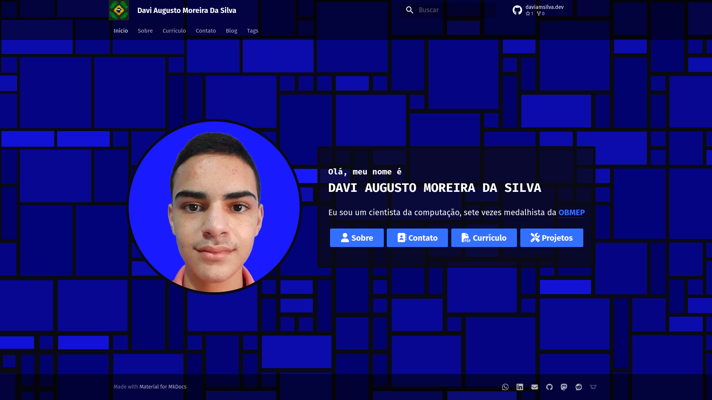

# [daviamsilva.dev](https://daviamsilva.dev)

<!-- markdownlint-disable MD051 -->

Um site pessoal que eu criei para mim utilizando [Material for MkDocs](https://squidfunk.github.io/mkdocs-material/).  
Inclui um [blog](https://daviamsilva.dev/blog/) contendo diversos de meus [projetos](https://daviamsilva.dev/blog/categoria/projetos/).

