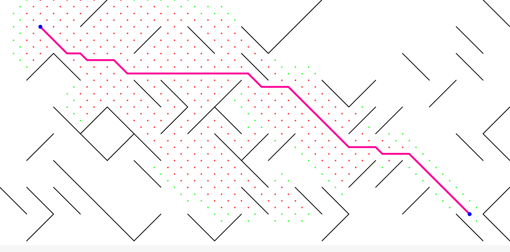

# 10 PRINT MAZE

[](https://github.com/DaviAMSilva/10-print-maze){ target="\_blank" rel="noopener noreferrer" }
[](https://openprocessing.org/sketch/743512){ target="\_blank" rel="noopener noreferrer" }
[](https://daviamsilva.github.io/10-print-maze/){ target="\_blank" rel="noopener noreferrer" }

---

O comando abreviado como `10 PRINT`, ou a sua versão completa `10 PRINT CHR$(205.5+RND(1)); : GOTO 10`, é originado no [Commodore 64](https://pt.wikipedia.org/wiki/Commodore_64), escrito na linguagem [BASIC](https://pt.wikipedia.org/wiki/BASIC). Ao executar esse simples comando nessa máquina o resultado é algo similar ao um labirinto, mas com resultado visual complexo e cheio de padrões interessantes de se observar.

Eu primeiro descobri esse padrão no vídeo [:simple-youtube: Coding Challenge #76: 10PRINT in p5.js](https://www.youtube.com/watch?v=bEyTZ5ZZxZs) quase ao mesmo tempo que eu assistir o vídeo sobre o algoritmo de busca [A\*](https://pt.wikipedia.org/wiki/Algoritmo_A*) de nome [:simple-youtube: A\* Pathfinding Algorithm (Coding Challenge 51 - Part 1)](https://www.youtube.com/watch?v=aKYlikFAV4k). Ambos foram postados pelo canal do YouTube educacional [The Coding Train](https://www.youtube.com/@TheCodingTrain), que eu gosto bastante pelos seus vídeos que ensinam diversos tópicos sobre programação utilizando ferramentas gráficas, como o p5.js.

Eu fiquei fascinado como um comando tão simples tão curto um resultado tão interessante e, além disso, eu até hoje considero o A\* como um dos meus algoritmos favoritos, devido ao fato de ser um algoritmo com uma lógica fácil de entender e cuja a utilidade prática é enorme.

O único problema é o fato de que devido à geometria do padrão, para cada entrada no labirinto existe uma única saída o que não é muito interessante. Por causa disso na minha versão apenas uma porcentagem dos símbolos é realmente criada e serve como obstáculo para o caminho.



Na visualização acima é possível ver como os elementos são desenhados na tela, em que os pontos vermelhos são os caminhos já calculados (fechados) e os verdes são os possíveis caminhos a se analisar (abertos). Os dois pontos azuis são o ponto de início e fim, e a linha rosa representa o caminho atual sendo processado ou, após o término do algoritmo, o melhor caminho encontrado.

<div class="grid cards" markdown>
<div markdown>

Eu gosto bastante da maneira como eu implementei o sistema de gride diagonal e o sistema de símbolos, pelo fato de que não é um gride diagonal real, mas sim um gride ortogonal em que metade dos pontos estão omissos. Já o sistema de símbolos é baseado na definição de pontos de intersecção dentro de um grid 5x5 e uma função que desenha tal forma. Isso permite que novas forma sejam adicionadas facilmente.

Em retrospectiva eu deveria ter utilizado classes para essa utilidade específica, permitindo uma possível herança de propriedades, mas na época eu ainda estava pouco familiarizado com os conceitos próprios de POO.

</div>

```js title="Lookups.js" linenums="29"
var allSymbols = [];

var blank = [];
blank.draw = function () { }
allSymbols.push(blank);


var invSlash = [
    { x: 0, y: 0 },
    { x: 1, y: 1 },
    { x: 2, y: 2 },
    { x: 3, y: 3 },
    { x: 4, y: 4 }
];
invSlash.draw = function (x, y, size) {
    line(x, y, x + size, y + size);
}
allSymbols.push(invSlash);


var slash = [
    { x: 0, y: 4 },
    { x: 1, y: 3 },
    { x: 2, y: 2 },
    { x: 3, y: 1 },
    { x: 4, y: 0 },
];
slash.draw = function (x, y, size) {
    line(x, y + size, x + size, y);
}
allSymbols.push(slash);
```

</div>
