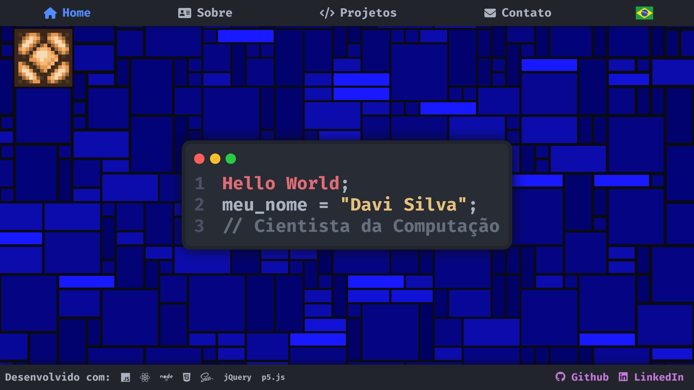

{ target="_blank" rel="noopener noreferrer" }

{ .badges }

---

É o meu site atual, em que você está lendo esse texto agora mesmo. Ele foi criado utilizando como base a [Material for MkDocs] para conter informações sobre mim, minhas formas de contato, apresentar o meu currículo digital e listar todos os meus projetos principais de programação.

A escolha dessa ferramenta foi devida à minha experiência usando-a no meu trabalho no [Kepi Supermercado] para documentar processos e organizar informações. Utilizando o modo *live preview* da aplicação é possível rodar um site localmente que atualiza em tempo real conforme for necessário adicionar e alterar os conteúdos da documentação.

Adicionalmente, é bem claro para mim que um dos melhores pontos positivos dessa ferramenta é a enorme capacidade de customização que ela permite, e como é incrivelmente fácil realizar tal customização. Entretanto isso não quer dizer que isso é um processo rápido, leva-se um bom tempo preparando as configurações e tentativa e erro para deixar o site da maneira como se deseja.

A qualidade e praticidade dessa customização vêm-se principalmente do sistema de plugins que o projeto se adere, tanto os internos quantos os construídos externamente pela comunidade. Os mais impressionantes e úteis que eu uso em meu site são o sistema de pesquisa, blog, tags e as várias opções de formatação adicionais.

---

{ align=right style="max-width:min(100%,500px)" }

A segunda característica interessante do meu site é a animação presente na página inicial, desenvolvida usando a biblioteca gráfica [p5.js]. Ela na verdade já tinha sido desenvolvida anos atrás para uma versão anterior de um site pessoal que eu nunca acabei finalizando.

Atualmente a animação é composto de um grid de retângulos que surgem aleatoriamente na tela e se expandem até não poderem mais, com um leve movimento dos tamanhos dos retângulos que também são afetados pela proximidade do mouse.

Entretanto originalmente a ideia era substituir um dos quadrados pela minha imagem de perfil (atualmente uma lâmpada do jogo Minecraft colorida como a bandeira do Brasil). Ao clicar nessa imagem todo o papel de parede seria desligado e a imagem seria substituída pela versão da lâmpada desligada, simulando uma tomada de luz. A ideia foi descartada para simplificar a interação da animação com a página em si.
