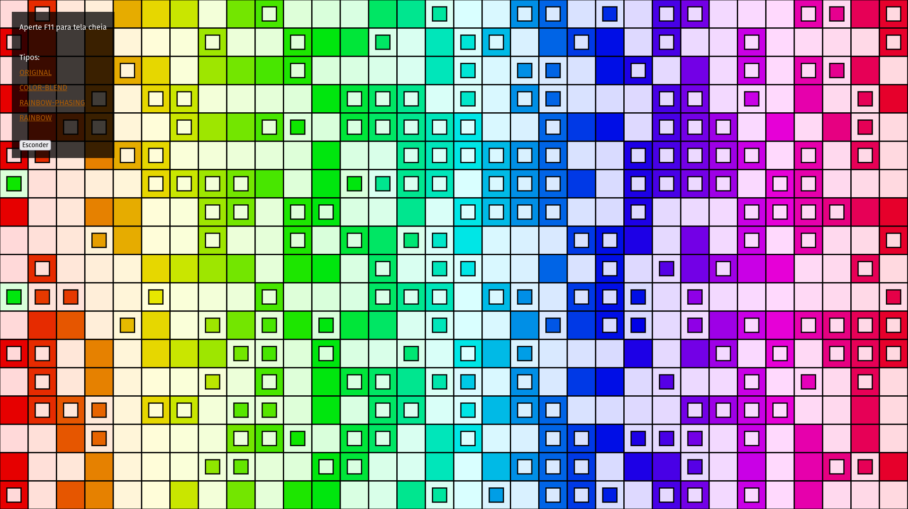
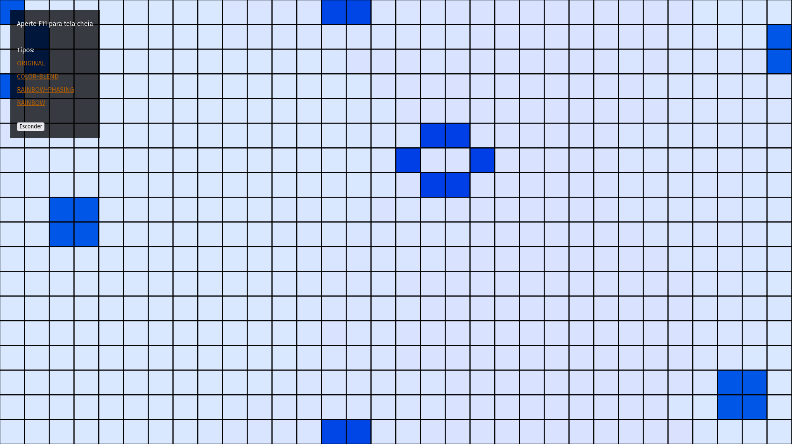

# Game of Life

{ target="_blank" rel="noopener noreferrer" }
{ target="_blank" rel="noopener noreferrer" }

---

Esse foi um dos primeiros *grandes* projetos que eu criei quando eu comecei a aprender programação.

*The Game of Life*, ou o [Jogo da Vida](https://pt.wikipedia.org/wiki/Jogo_da_vida), foi criado pelo matemático [John Conway](https://pt.wikipedia.org/wiki/John_Conway) em 1970, sendo um tipo de autômato celular.

Na época eu ainda tinha pouco conhecimento em como usar html e css, por isso vários dos projetos que eu criava usavam *sketches* do [p5.js](https://p5js.org/) em páginas de tela cheia.

Por acaso a versão original separava os tipos de visualizações diferentes em arquivos `.js` diferentes e não permitir realizar a troca de maneira dinâmica. Apenas recentemente eu implantei essa opção.

Minha intenção foi expandir a versão simples do jogo da vida que eu tinha criado na [Khan Academy](https://pt.khanacademy.org) ([Conway's game of life v2.0](https://pt.khanacademy.org/computer-programming/conways-game-of-life-v20/4707795601031168)) para incluir um nível a mais de complexidade. Eu imaginei o que aconteceria se as células contivessem informações sobre cores e como elas poderiam interagir entre si.

Eu acabei criando quatro versões do jogo da vida nesse projeto:

- **ORIGINAL**

    A versão básica do jogo. Para todas os tipos o movimento do mouse torna as células vivas e o clique do mais limpa todo o tabuleiro. Além disso células nas bordas do tabuleiro são vizinhas das células na borda oposta.

- **RAINBOW**

    Funcionalmente idêntico à versão **ORIGINAL**, mas utilizando as cores do espectro HSL.

- **RAINBOW-PHASING**

    Funcionalmente idêntico à versão **ORIGINAL**, mas a tonalidade da células muda de acordo com o espectro HSL e a intensidade de acordo com a quantidade de vizinhos que cada célula possuí.

- **COLOR-BLEND**

    Esse é o motivo principal que eu decidi criar todo esse projeto. Nessa versão quando uma nova célula nasce a sua cor é determinada pela média aritmética das cores das três células vizinhas que a criou. Além disso células mortas mantêm a cor que tinham ao morrer.

    O resultado foi aquilo que eu esperava, em que após algum tempo todo o tabuleiro tende a ser dominado por uma única cor, sendo ela diferente para cada instância da simulação, devido à aleatorização das células no início.

=== "Início do Jogo (aleatório)"

    

=== "Fim do Jogo (azuis dominaram)"

    
