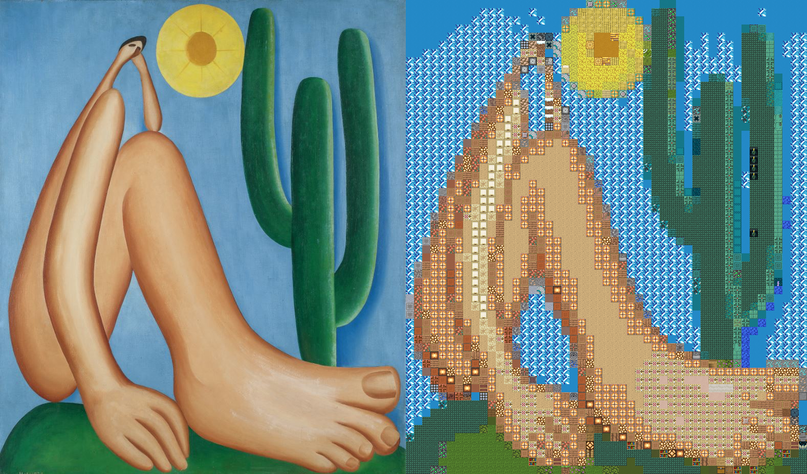

{ target="_blank" rel="noopener noreferrer" }
{ .badges }

---

Mosaico de Fotos é um programa escrito em Python para criar mosaicos de fotos a partir de uma imagem principal e várias imagens fontes.

O caso de uso original foi pegar várias imagens de família e juntá-las para formar uma única imagem composta especial. Apesar disso, o fato de o programa trabalhar exclusivamente com peças quadradas o torna particularmente interessante para redesenhar imagens utilizando blocos do jogo Minecraft.

Exemplo de uso utilizando blocos de Minecraft na pintura **Abaporu** da pintora **Tarsila do Amaral**:

