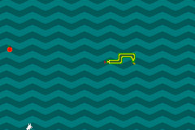
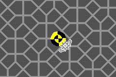

{ target="_blank" rel="noopener noreferrer" }

---

Esse foi um projeto que eu realizei individualmente durante o segundo semestre da minha graduação na Doctum. Ele envolvia a criação de um jogo para a plataforma [Game Boy Advance](https://pt.wikipedia.org/wiki/Game_Boy_Advance) da empresa Nintendo, lançado em 2001.

O projeto era de escolha livre, desde que utilizasse a linguagem C. Os motivos que me levaram a essa escolha foram basicamente:

1. Os jogos desenvolvidos para o GBA, oficiais ou criados por fãs, são desenvolvidos em C, apesar de possivelmente utilizarem partes específicas escritas em Assembly.
2. Eu gosto de jogos eletrônicos e não discrimino jogos clássicos ou retro.
3. Eu possuo um Game Boy Advance SP (variação do GBA original) e poderia usar o trabalho como incentivo para comprar um [aparelho](https://www.gbxcart.com/) e um [cartucho](https://shop.insidegadgets.com/product/gba-32mb-1mbit-flash-save-with-rtc-flash-cart-works-with-pokemon-games/) capazes de gravar ROMs de jogos para serem jogados em hardware original.

A plataforma só está disponível para desenvolvimento amador devido ao trabalho de várias pessoas que realizaram e continuam realizando engenharia reversa no dispositivo e jogos para documentar as técnicas de desenvolvimento hoje existentes. Alguns dos projetos utilizados durante o desenvolvimento foram [devkitPro](https://devkitpro.org/), [Tonc](https://www.coranac.com/tonc/text/toc.htm), [grit](https://www.coranac.com/projects/grit/), [GBATek](http://problemkaputt.de/gbatek.htm) e [CowBite](https://www.cs.rit.edu/~tjh8300/CowBite/CowBiteSpec.htm).

Devido a essa complexidade técnica da plataforma e como ela me forçou a ser muito mais atento com o código que eu desenvolvia eu até hoje considero esse como o projeto do qual eu tenho mais orgulho de ter realizado. Para mim é um dos projetos mais organizados e *completos* que eu já criei devido a todas as ferramentas internas que eu tive de criar para suportar o desenvolvimento e compilação do projeto, includindo o melhor [makefile](https://github.com/DaviAMSilva/Arcade_Mania/blob/master/makefile) que eu já criei. No final tudo valeu a pena quando eu tive a oportunidade de jogar meu jogo finalizado no meu GBA SP original, que foi uma experiência quase surreal.

!!! info "Como experimentar"

    Baixe a [release mais recente](https://github.com/DaviAMSilva/Arcade_Mania/releases/tag/latest) do arquivo *Arcade_Mania.gba* e instale um emulador do GBA (eu recomendo o [mGBA](https://mgba.io)). Por fim abra o arquivo no emulador e aproveite.

Esse projeto originalmente compunha apenas 2 jogos **Snake** e **Memory Raid**, mas após algum tempo depois da entrega do trabalho eu tive a vontade de implementar um porte do jogo **Wordle**, quando ele estava ganhando popularidade na internet. O motivo do uso desses jogos inicialmente baseia-se parcialmente do fato que **Snake** pode ser melhor criado usando *tiles*, enquanto para **Memory Raid** o ideal é utilizar *sprites*, sendo os dois principais sistemas gráficos do GBA.

- **Snake**

    
    

    É uma versão bem simples do jogo clássico, apenas contendo a adição de um coelho que se move aleatoriamente e um *power-up* que te deixa invencível e aumenta a velocidade do jogo. Apesar da simplicidade ele é divertido divertido devido ao movimento errático do coelho e ao controle super rápido da cobra em si.

- **Memory Raid**

    
    
    

    Esse é um jogo de memorização de padrões de cores e direções de ataques que precisam ser bloqueados. É baseado em uma luta contra o personagem [Undyne](https://undertale.fandom.com/pt-br/wiki/Undyne) do jogo [UNDERTALE](https://undertale.com/), mas envolve a memorização em 8 direções, ao invés de reação rápida em 4 direções. Infelizmente eu não cheguei em um bom balanço do jogo, ou ele era muito rápido e difícil, ou devagar e chato, e portanto não há muito interesse de continuar jogando.

- **Wordle**

    
    

    Apesar de ter sido implementado por último é o jogo mais interessante da lista, visto que é baseado diretamente em um jogo já popular e que não requer muito do aspecto gráfico. A lista de palavras utilizadas é a mesma utilizada pela versão original do [New York Times](https://www.nytimes.com/games/wordle/index.html).
