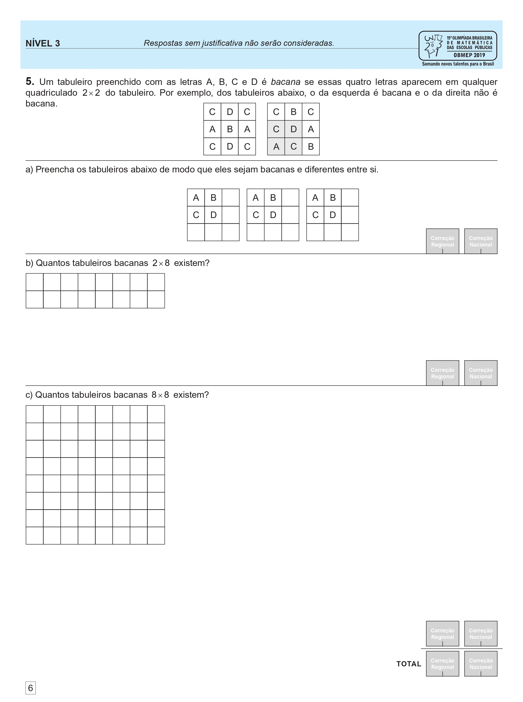
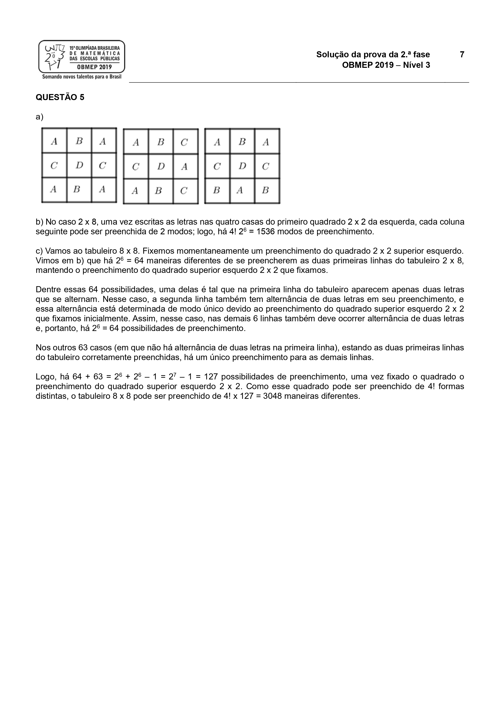

# Tabuleiro Bacana

{ target="_blank" rel="noopener noreferrer" }

---

Quando eu participei da prova do terceiro nível da segunda fase da OBMEP 2019 a questão 5 foi uma que me deixou muito intrigado se a solução que eu desenvolvi durante o teste estava correta. Por causa disso logo após terminar a prova eu fiquei curioso e decidi escrever um algoritmo capaz de resolver o problema.

Essa edição específica da olimpíada foi a minha última aonde eu conquistei minha terceira medalha de ouro.

O problema em questão envolve tabuleiros bacanas, descritos como:

> Um tabuleiro preenchido com as letras A, B, C e D é bacana se essas quatro letras aparecem em qualquer quadriculado 2×2 do tabuleiro. Por exemplo, dos tabuleiros abaixo, o da esquerda é bacana e o da direita não é bacana.
>
> $$
> \begin{array}{|c|c|c|}
> \hline
> \text{C}&\text{D}&\text{C}\\
> \hline
> \text{A}&\text{B}&\text{A}\\
> \hline
> \text{C}&\text{D}&\text{C}\\
> \hline
> \end{array}
> \\ \space\space\space\space\space
> \begin{array}{|c|c|c|}
> \hline
> \text{C}&\text{B}&\text{C}\\
> \hline
> \text{C}&\text{D}&\text{A}\\
> \hline
> \text{A}&\text{C}&\text{B}\\
> \hline
> \end{array}
> $$

??? abstract "Prova e Solução"

    

    

    [Prova: :fontawesome-solid-file-pdf: pf2n3-2019.pdf](https://drive.google.com/file/d/1kzQRxdQYGc2S5Z1jl6tz4DgOgLdyXg2Z/view)

    
    

    

    [Soluções: :fontawesome-solid-file-pdf: sf2n3-2019.pdf](https://drive.google.com/file/d/14fDuxVvEEi-GbEjluuNX_Y_9lf9OAtRw/view)

    
    

    

Especificamente a letra c) da questão 5 pergunta *Quantos tabuleiros bacanas 8×8 existem?*. Eu não irei entrar em detalhes sobre a solução matemática, visto que a solução oficial acima é similar à minha.

O algoritmo que eu desenvolvi para resolver esse problema envolve o uso dos métodos de força bruta e recursividade. Basicamente cada quadrado, da esquerda para a direita, de cima para baixo, é visitado uma vez para cada uma das letras e calcula recursivamente quantos casos possíveis existem para o próximo quadrado para cada letra, desde ela seja válida. No final todos os casos possíveis retornam 1 e são somados para gerar o resultado.

Como se pode imaginar esse algoritmo não é eficiente, mas esse não foi um objetivo meu de qualquer jeito. Percebe-se que o algoritmo precisa percorrer tantos níveis de recursão quanto quadrados no tabuleiro e que para cada quadrado há 4 casos possíveis e para cada caso é necessário criar uma cópia do tabuleiro.

Por causa disso eu acredito que a complexidade temporal desse algoritmo é $O\left(4^{n^2}\right)$, enquanto a complexidade espacial é $O\left(n^2 \times 4^{n^2}\right)$. É claro que isso se aplicaria apenas para o pior caso possível, sendo que na prática a maioria das possibilidades se tornarão inválidas e a recursão interrompida antes de completar todo o tabuleiro, mesmo assim isso demonstra a ineficiência desse algoritmo.

Após terminar esse projeto eu pude verificar que minha solução estava de acordo com o resultado gerado pelo meu algoritmo e depois da liberação das repostas respostas oficiais eu tive a confirmação de que eu respondi corretamente todas as letras dessa questão.

*[OBMEP]: Olimpíada Brasileira de Matemática das Escolas Públicas
