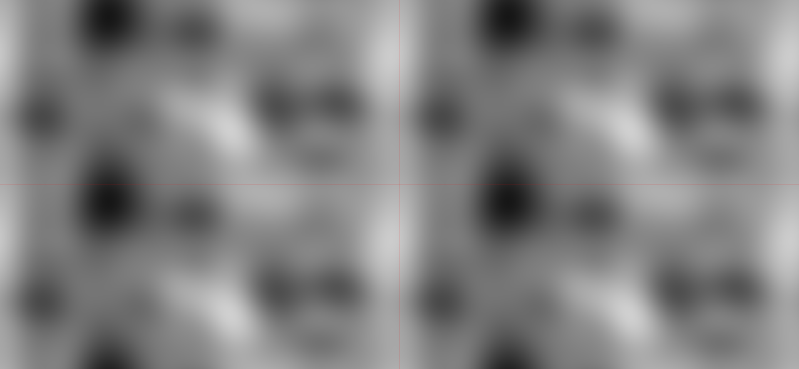

{ target="_blank" rel="noopener noreferrer" }
{ .badges }

TileableNoise.js é uma simples biblioteca na forma de uma classe que ajuda a criar imagens de ruídos que se conectam perfeitamente.

Essa biblioteca usa a ideia de pegar o resultado de uma função de ruído, andando em volta de um círculo, para que o valor inicial seja igual ao valor final, permitindo ruído conectável em 1D e 2D.

Usando dois círculos em um espaço de ruído 4D é possível criar ruído repetível em um ambiente 2D.

Eu tirei minha inspiração de um vídeo do Daniel Shiffman's: [Coding Challenge #136.1: Polar Perlin Noise Loops](https://www.youtube.com/watch?v=ZI1dmHv3MeM), do canal [The Coding Train](https://www.youtube.com/channel/UCvjgXvBlbQiydffZU7m1_aw).

*Imagem feita com a biblioteca. As linhas vermelhas marcam o local da repetição.*
{ style="text-align:center" }
