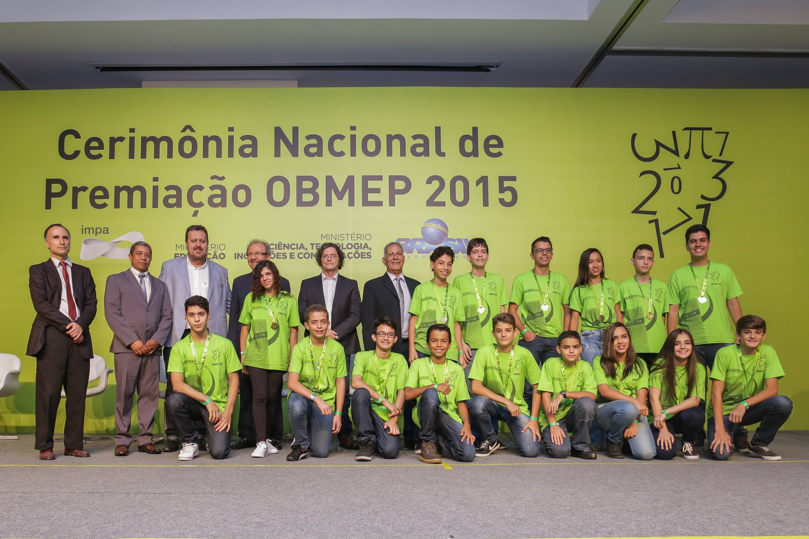
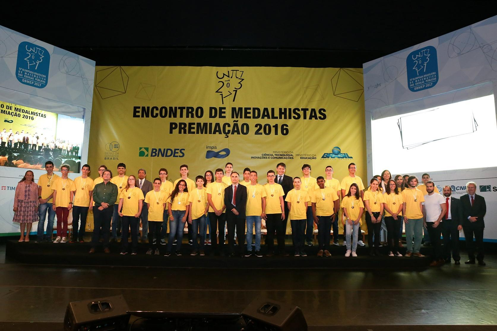
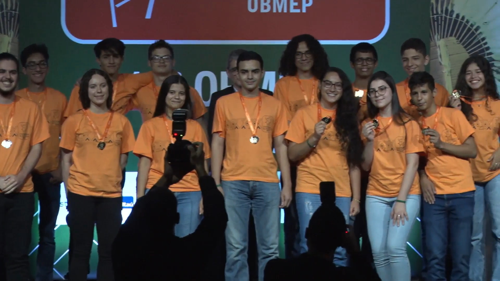

# Sobre Mim

**Meu nome é <abbr>Davi&nbsp;Augusto&nbsp;Moreira&nbsp;da&nbsp;Silva</abbr>.**

Eu sou formado em Ciência da Computação pela [Rede de Ensino Doctum de Caratinga](https://vest.doctum.edu.br/unidades/caratinga/). Eu comecei a ter uma fascinação a programação durante o ensino médio, mas já me interessava com computadores e com a matemática desde minha infância.

## Programação

Eu primeiro aprendi programação pelo JavaScript na [Khan Academy](https://pt.khanacademy.org/computing/computer-programming) utilizando a biblioteca gráfica p5.js e vários dos meus [projetos iniciantes](../tags.md/#p5js) foram criados utilizando-a. Desde então eu já aprendi os conceitos mais avançados dos usos do JS na web e nos ecossistemas baseado em Node e npm e estou mais ou menos ciente das funcionalidades mais modernas da linguagem.

Desde então eu já expandi para outras linguagens, principalmente Python devido a velocidade com que projetos simples podem ser desenvolvidos, mas ainda sim mantendo um poder enorme de realizar qualquer tarefa complexa. Eu estou acostumado com a ferramenta pip, ambientes virtuais e algumas das bibliotecas mais comuns, como Pillow e tqdm.

Eu também já estou bem acomodado a utilizar HTML e CSS/SCSS em conjunção com JavaScript para construir páginas WEB para diversos projetos. Entretanto eu geralmente trabalho melhor com a parte técnica do desenvolvimento do que a parte visual.

Por fim eu tenho experiência informal realizando *queries* em SQL Server para gerar relatórios e ferramentas de trabalho no meu trabalho no [Kepi Supermercado](../curriculo.md#kepi-supermercado).

## Olimpíada Brasileira de Matemática das Escolas Públicas <small>[Resultados](conquistas.md#obmep)</small> { #obmep }

No ano de 2013 eu recebi a minha primeira medalha da OBMEP, de bronze, sendo na época uma conquista enorme, mas na verdade era apenas o início. Durante os anos de 2013 a 2019 eu cheguei a receber 7 medalhas (1), incluindo 3 medalhas de ouro.
{ .annotate }

1. Medalhas:

    2013:&nbsp;🥉&nbsp;Bronze  
    2014:&nbsp;🥈&nbsp;Prata  
    2015:&nbsp;🥇&nbsp;Ouro  
    2016:&nbsp;🥇&nbsp;Ouro  
    2017:&nbsp;🥈&nbsp;Prata  
    2018:&nbsp;🥈&nbsp;Prata  
    2019:&nbsp;🥇&nbsp;Ouro

Cada medalha foi acompanhada por uma participação do curso PIC de matemática avançada fornecida e uma bolsa do CNPq de R$&nbsp;1.200,00. Além disso para cada medalha de ouro eu tive a oportunidade de participar de uma Cerimônia Nacional de Premiação da OBMEP, com tudo pago. A [primeira](http://www.obmep.org.br/cerimonia2015.htm) e a [segunda](http://www.obmep.org.br/cerimonia2016.htm) cerimônias que eu participei ocorreram na cidade do Rio de Janeiro, já a [terceira](http://www.obmep.org.br/cerimonia-nacional-15-obmep.htm) ocorreu em Salvador.

=== "OBMEP 2015"

    
    { .imagem-obmep }

=== "OBMEP 2016"

    
    { .imagem-obmep }

=== "OBMEP 2019"

    
    { .imagem-obmep }
