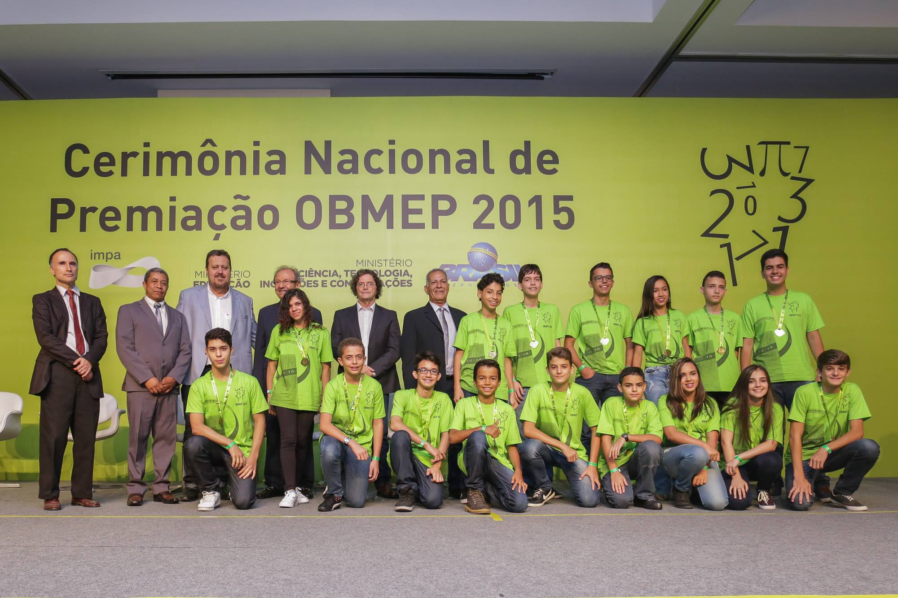
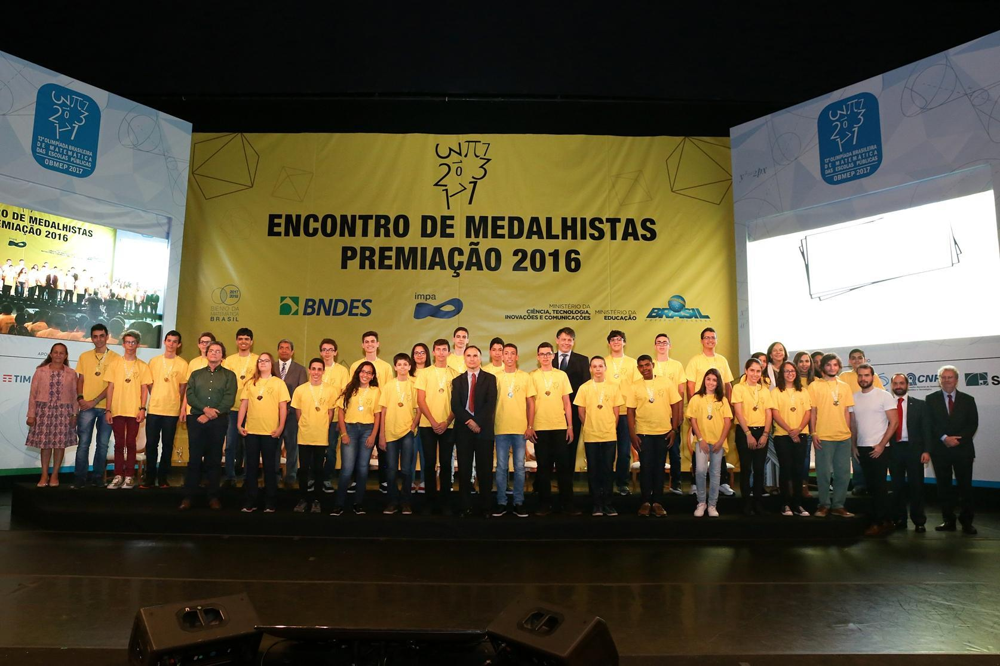
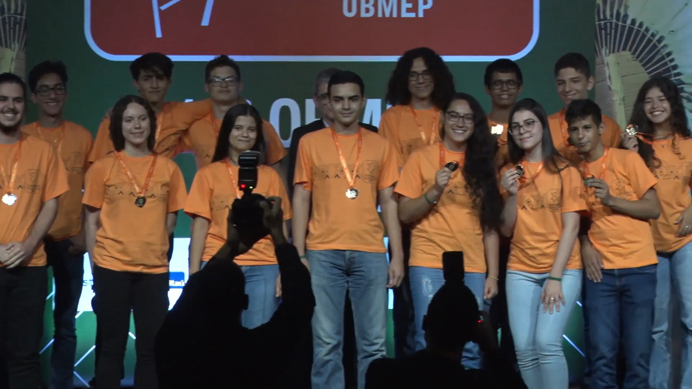

# Sobre Mim

**Meu nome é <abbr>Davi&nbsp;Augusto&nbsp;Moreira&nbsp;da&nbsp;Silva</abbr>.**

Eu sou formado em Ciência da Computação pela [Rede de Ensino Doctum de Caratinga](https://vest.doctum.edu.br/unidades/caratinga/). Eu comecei a ter uma fascinação a programação durante o ensino médio, mas já me interessava com computadores e com a matemática desde minha infância.

[:fontawesome-brands-linkedin:&nbsp;LinkedIn](https://www.linkedin.com/in/daviamsilva/) — /in/daviamsilva

[:fontawesome-brands-github:&nbsp;GitHub](https://github.com/DaviAMSilva/) — github.com/DaviAMSilva

[:fontawesome-solid-envelope:&nbsp;E-mail](mailto:daviamsilva@hotmail.com) — daviamsilva@hotmail.com <!-- markdownlint-disable-line no-bare-urls -->

[:fontawesome-brands-reddit:&nbsp;Reddit](https://www.reddit.com/user/DaviAMSilva/) — /u/DaviAMSilva

[:fontawesome-brands-x-twitter:&nbsp;Twitter](https://x.com/DaviAMSilva) — @DaviAMSilva

## Programação

Eu primeiro aprendi programação pelo JavaScript na [Khan Academy](https://pt.khanacademy.org/computing/computer-programming) utilizando a biblioteca gráfica p5.js e vários dos meus [projetos iniciantes](../tags.md/#tag:p5js) foram criados utilizando-a. Desde então eu já aprendi os conceitos mais avançados dos usos do JS na web e nos ecossistemas baseado em Node e npm e estou mais ou menos ciente das funcionalidades mais modernas da linguagem.

Desde então eu já expandi para outras linguagens, principalmente Python devido a velocidade com que projetos simples podem ser desenvolvidos, mas ainda sim mantendo um poder enorme de realizar qualquer tarefa complexa. Eu estou acostumado com a ferramenta pip, ambientes virtuais e algumas das bibliotecas mais comuns, como Pillow e tqdm.

Eu também já estou bem acomodado a utilizar HTML e CSS/SCSS em conjunção com JavaScript para construir páginas WEB para diversos projetos. Entretanto eu geralmente trabalho melhor com a parte técnica do desenvolvimento do que a parte visual.

Por fim eu tenho experiência informal realizando *queries* em SQL Server para gerar relatórios e ferramentas de trabalho no meu trabalho no [Kepi Supermercado].

## Olimpíada Brasileira de Matemática das Escolas Públicas <small>[Resultados](conquistas.md#obmep)</small> { #obmep }

??? question "O que é a OBMEP?"

    
    { .logo-obmep }

    
    { .logo-obmep }

    Fonte: [OBMEP](http://www.obmep.org.br)
    { style="color: var(--md-default-fg-color--light)" }

    A OBMEP é um projeto nacional dirigido às escolas públicas e privadas brasileiras, realizado pelo IMPA e promovido com recursos do Ministério da Educação - MEC e do Ministério da Ciência, Tecnologia e Inovação - MCTI.

    Criada em 2005 para estimular o estudo da matemática e identificar talentos na área, a OBMEP tem como objetivos principais:

    - Estimular e promover o estudo da Matemática;
    - Contribuir para a melhoria da qualidade da educação básica, possibilitando que um maior número de alunos brasileiros possa ter acesso a material didático de qualidade;
    - Identificar jovens talentos e incentivar seu ingresso em universidades, nas áreas científicas e tecnológicas;
    - Incentivar o aperfeiçoamento dos professores das escolas públicas, contribuindo para a sua valorização profissional;
    - Contribuir para a integração das escolas brasileiras com as universidades públicas, os institutos de pesquisa e com as sociedades científicas;
    - Promover a inclusão social por meio da difusão do conhecimento.

    O público-alvo da OBMEP é composto de alunos do 6º ano do Ensino Fundamental até último ano do Ensino Médio. 

No ano de 2013 eu recebi a minha primeira medalha da OBMEP, de bronze, sendo na época uma conquista enorme, mas na verdade era apenas o início. Durante os anos de 2013 a 2019 eu cheguei a receber 7 medalhas (1), incluindo 3 medalhas de ouro.
{ .annotate }

1. Medalhas:

    2013:&nbsp;🥉&nbsp;Bronze  
    2014:&nbsp;🥈&nbsp;Prata  
    2015:&nbsp;🥇&nbsp;Ouro  
    2016:&nbsp;🥇&nbsp;Ouro  
    2017:&nbsp;🥈&nbsp;Prata  
    2018:&nbsp;🥈&nbsp;Prata  
    2019:&nbsp;🥇&nbsp;Ouro

Cada medalha foi acompanhada por uma participação do curso PIC de matemática avançada fornecida e uma bolsa do CNPq de R$&nbsp;1.200,00. Além disso para cada medalha de ouro eu tive a oportunidade de participar de uma Cerimônia Nacional de Premiação da OBMEP, com tudo pago. A [primeira](http://www.obmep.org.br/cerimonia2015.htm) e a [segunda](http://www.obmep.org.br/cerimonia2016.htm) cerimônias que eu participei ocorreram na cidade do Rio de Janeiro, já a [terceira](http://www.obmep.org.br/cerimonia-nacional-15-obmep.htm) ocorreu em Salvador.

=== "OBMEP 2015"

    
    { .imagem-obmep }

=== "OBMEP 2016"

    
    { .imagem-obmep }

=== "OBMEP 2019"

    
    { .imagem-obmep }
